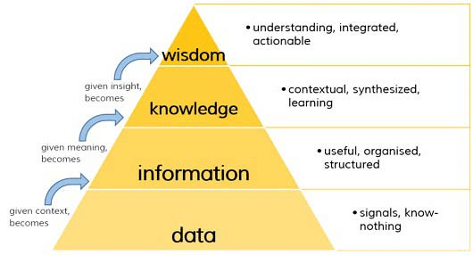
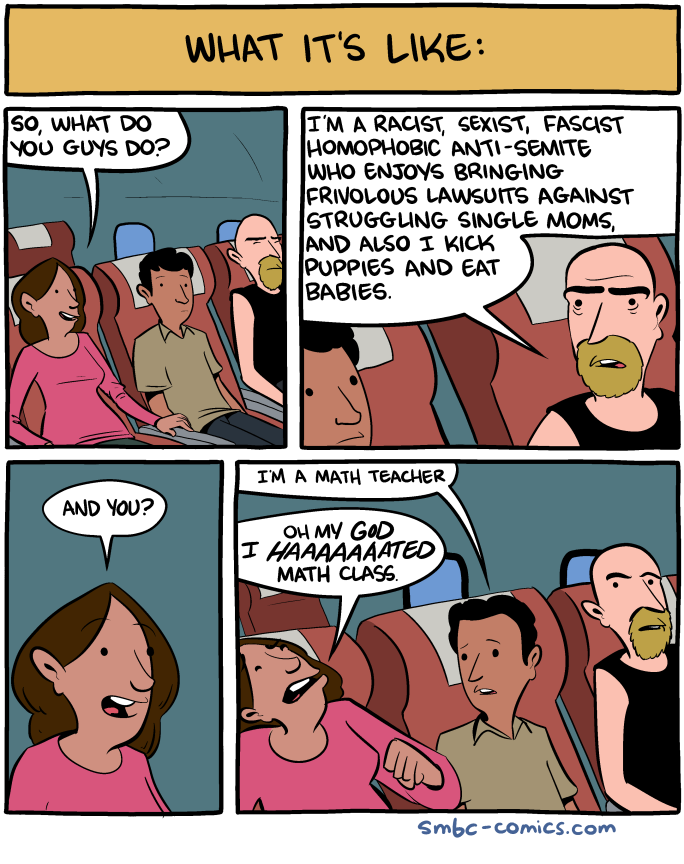
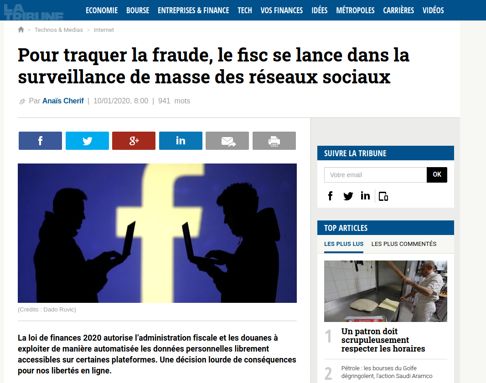
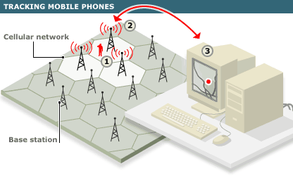
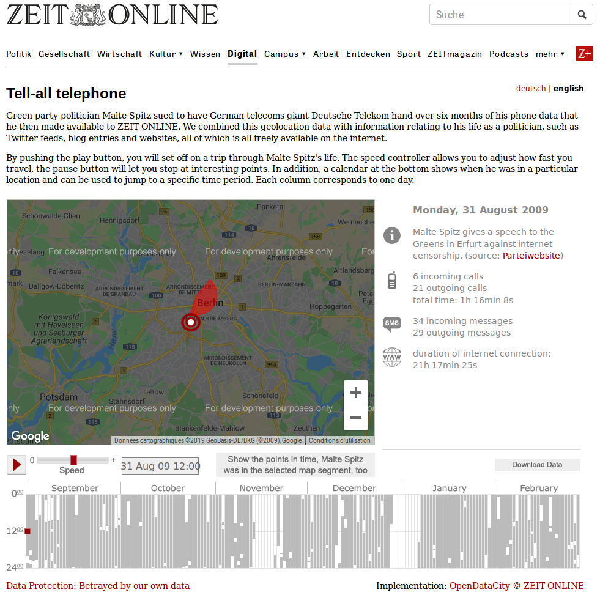
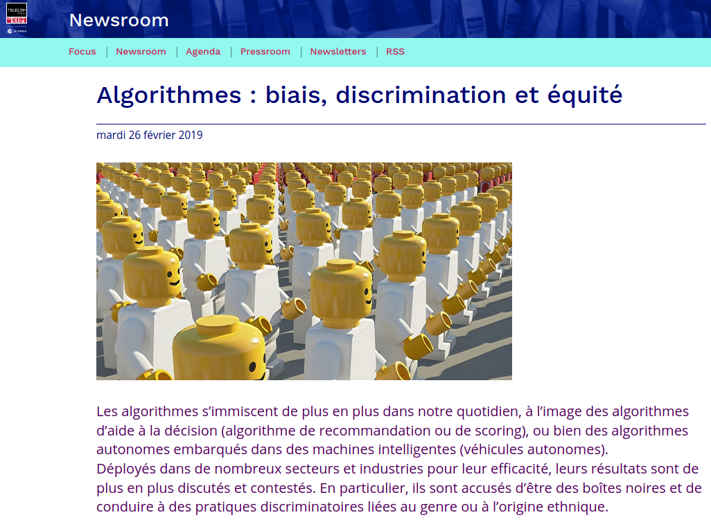
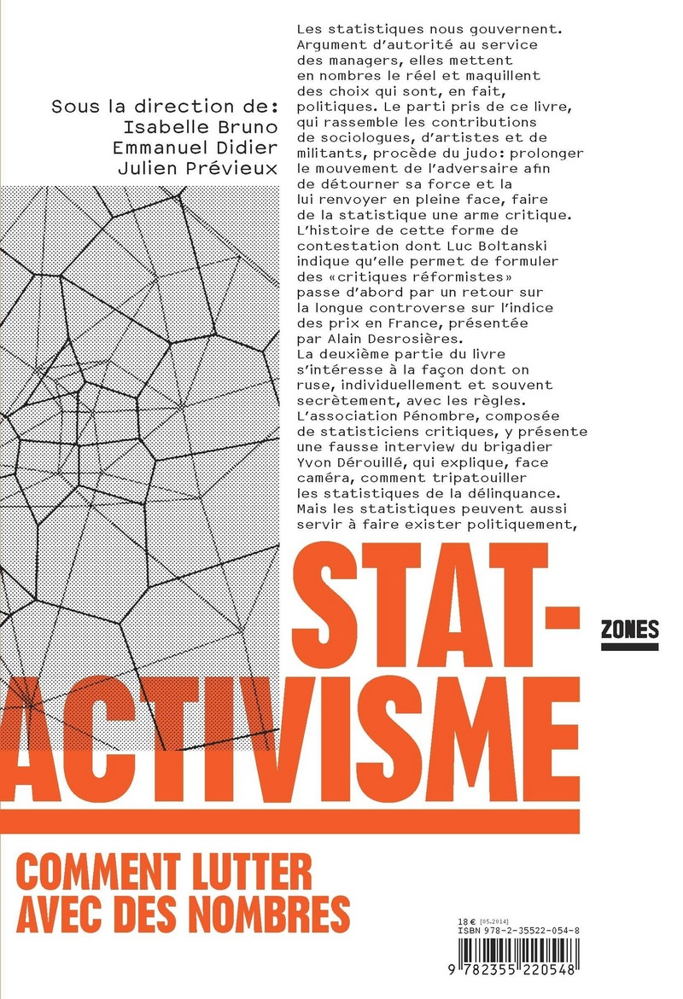
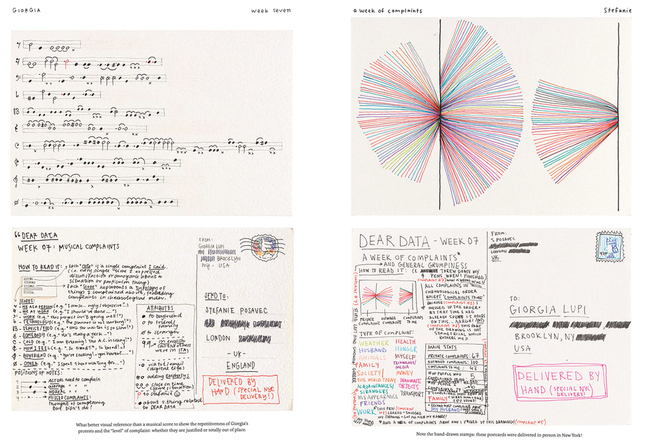

layout: true

`r paste0("
", params$event, " 

")` 

---

class: center, middle

Ces slides en ligne : `r paste0("http://datactivist.coop/", params$slug)`

Sources : `r paste0("https://github.com/datactivist/", params$slug)`

Les productions de Datactivist sont librement réutilisables selon les termes de la licence [Creative Commons 4.0 BY-SA](https://creativecommons.org/licenses/by-sa/4.0/legalcode.fr).

 
 

---

background-image: url("https://media.giphy.com/media/h1usHXc3P8XD5fVjB0/giphy.gif")
class: center, top, inverse

# I .Données partout, justif nulle part ...

---

### Data sondage

.pull-left[
1. Qui a son portable allumé ?
2. Qui a la géolocalisation activée ?
3. Qui est venu en voiture ?
4. Qui a pris les transports en commun ?
5. Qui a posté une info sur cet atelier sur les réseaux sociaux ?
6. Qui a regardé une vidéo dans les transports en commun ?
]

--

.pull-right[
1. Vous transmettez des données à votre opérateur.
2. Vous avez transmis des données à Google (Alphabet).
3. Vous avez transmis des données à Waze (Alphabet).
4. Vous avez transmis des données à l'opérateur de transport.
5. Vous avez transmis des données à Twitter, Facebook, Instagram (Facebook).
6. Vous avez transmis des données à Youtube (Alphabet).
]

--

Bref, **vous produisez des données en permanence, de manière active ou passive**.

---

### Pour qui sont siphonées ces données ?

* quels organismes publics ?
* quels organismes privés ?
* d'où chacun les tire, les récupère ?

--

Les data brokers servent d'intermédiaire dans la constitution de bases de données.

---

### Mais c'est quoi en fait une donnée ?

Hein, selon vous ?

--

Les catégorisations sont multiples :
* Numériques, chaînes de caractères ou booléens.
* Structurées, non structurées.
* Qualitatives, quantitatives.

--

Le seul point commun : **une donnée est toujours collectée** dans une base de données (par ailleurs souvent appelée collection).

Elle ne constitue pas pour autant une information ou un savoir.

---

### L'aggrégation, préalable à toute connaissance

.pull-left[
Un relevé n'a aucun sens sans contexte. Seule une collection peut délivrer une information.

Ex. : il fait 12 dégré à midi à Saint-Etienne. Cela ne nous dit pas s'il fait chaud, froid, si la température évolue, s'il fait meilleur qu'ailleurs. A moins de confronter cette donnée à d'autres relevée à d'autres moments ou d'autres lieux.

Plus les données sont aggrégées et plus le potentiel de connaissance est grand. Par conséquent, plus on peut produire de valeur à partir d'elle, là où chaque unité n'en a pas.
]

.pull-right[

La pyramide DIKW, attribuée à Ackoff (1989), complétée par Soloviev (2016).
]

---

### Economie de la donnée

.pull-left[
Les industries de la donnée étant principalement des entreprises de service, la collecte massive est essentielle pour les fonctionnalités qu'elles proposent : filtre (Facebook, Google), recommandation (Amazon, Youtube), matchmaking (Tinder, Uber) ...

A votre avis :
combien rapporte un·e usager·ère européen·ne à Facebook ?
]

--

.pull-right[
Selon le rapport annuel d'activité de la société* : 35€. Pas grand chose.

Sauf si on le multiplie par 281 millions d'inscrit·e·s sur le continent en 2018.

]

--

Mais la donnée c'est compliqué. Nous dit-on.

.footnote[\*
*[Rapport annuel 2018](https://investor.fb.com/financials/default.aspx) de la compagnie Facebook, cité par [#DATAGUEULE épisode 95](https://www.youtube.com/watch?v=G1_ryVCLWoc&t=1s)*.
]

---

### "Ah, je déteste les maths !"

.pull-left[
[Depuis l'étude Spencer, Steel & Quinn (1999)](https://www.tandfonline.com/doi/full/10.1080/23743603.2018.1559647), le stéréotype de genre a été identifié comme un facteur d'autodisqualification puissant, suivant le principe de la **menace de stéréotype** : *"je suis mauvaise en math parce que je suis une fille"*.

La professeure en sciences l'éducation de l'université de Stanford [Jo Boaler](https://ed.stanford.edu/faculty/joboaler) a établit le concept du [*fixed mindset*](https://ed.stanford.edu/news/cultivating-growth-mindset-math) pour les mathématiques : certains modes éducatifs enferment les étudiant·e·s dans un **état d'esprit fermé** qui les paralyse dans l'apprentissage et la maîtrise de cette discipline.
]

.pull-right[

.footnote[Source : [SMBC](https://www.smbc-comics.com/comic/what-its-like), merci à Robin Ryder pour la découverte.]

]

---

### Un enjeu démocratique

.center[

]

.footnote[Source : [La Tribune](https://www.latribune.fr/technos-medias/internet/pour-traquer-la-fraude-le-fisc-se-lance-dans-la-surveillance-de-masse-des-reseaux-836782.html), 2020.]

---

background-image: url("https://media.giphy.com/media/Vtk2HG3rtGeNa/giphy.gif")
class: center, inverse

# II. Unité de démesure

---

### Pourquoi collecter des données ?

Aucune donnée n'est immanente : sa collecte nécessite des décisions, des méthodes et des moyens. En clair, des choix.

L'exercice le plus classique : le recensement. Rien que dans Bible, on compte au moins quatre recensements, dont celui décidé par l'Empereur Auguste.

Plusieurs auteurs romains attestent de ce projet : Auguste souhaitait faire "un inventaire des ressources de son empire" : *"le nombre des citoyens et des alliés en armes, celui des flottes, des royaumes, des provinces"* (Tacite, Annales, 1,11)

En 1676, Vauban ordonne le recensement de Valenciennes : le premier recensement *"tête par tête"* de l'histoire de France. Son objectif : *"actifs économiques et démographiques"*.

--

Historique, les statistiques (littéralement science de l'Etat) servent à deux choses : lever les impôts et faire la guerre.

---

### Un exercice exemplaire : le recensement

Le budget du recensement est fixé par la loi. En l'occurrence, [le décret du 17 décembre 2015](https://www.legifrance.gouv.fr/affichTexte.do?cidTexte=JORFTEXT000031632586&categorieLien=id) :
* 1.72€ par personne et 1.13€ par logement en "métropole" ;
* 2.05€ par personne et 1.36€ par logement dans les départements d'Outre-Mer, Saint-Pierre-et-Miquelon, Saint-Barthélemy et Saint-Martin.

Ces dernières années, le coût a totalisé environ 20 millions d'euros par an ([Sénat, 2017](https://www.senat.fr/questions/base/2017/qSEQ171202311.html)).

Et ça prend du temps : quatre ans de collecte, compilation, traitement et publication des résultats.

---

### Le besoin de définition

Quelle est [la définition du chômage](https://www.insee.fr/fr/metadonnees/definition/c1129) ?

--

Définition (BIT, 1982) :
* un chômeur est une personne en âge de travailler (15 ans ou plus) qui répond simultanément à trois conditions :
* être sans emploi, c'est à dire ne pas avoir travaillé au moins une heure durant une semaine de référence ;
* être disponible pour prendre un emploi dans les 15 jours ;
* avoir cherché activement un emploi dans le mois précédent ou en avoir trouvé un qui commence dans moins de trois mois.

--

Comment peut-on le faire baisser sans modifier la définition ?

--

Tout le problème est dans la question : veut-on changer la société ou la valeur de l'indicateur ?

---

### Du descriptif au prescriptif

.pull-left[
Les mesures se muent progressivement en outils d'évaluation de la performance.

Et inversement : des outils d'évaluation de l'activité sont utilisés comme outils de mesure. Par exemple, l'état 4001.

En transformant ainsi des outils descriptifs en outils prescriptifs, la production même de la donnée est biaisée : le chiffre finit par primer sur la réalité et encourage les arrangements plus que les améliorations dans les organisations.
]

.pull-right[

]

---

### La géoloc : donnée de base

La géolocalisation est une donnée essentielle à l'acheminement du signal vers les usager·ère·s des réseaux mobiles. Elle repose sur la triangulation du signal téléphonique par les tours relais.

.center[

]

--

Or, cette donnée "nécessaire" permet de collecter des informations extrêmement précises sur les individus. Informations dont la confidentialité peut être mise à mal, que ce soit par des organisations privées ou publiques (voir [*The problem with mobile phone*, Electronic Frontier Foundation, 2018](https://ssd.eff.org/en/module/problem-mobile-phones)).

.footnote[\* Source infographie : [BBC](http://news.bbc.co.uk/2/hi/technology/4738219.stm).]

---

class: inverse

#### Ce que la géoloc dit de nous

Rien à cacher, vraiment ?

[Tell all telephone](https://www.zeit.de/datenschutz/malte-spitz-data-retention) (Die Zeite, 2009).

---

### Les algos : tout est écrit (par quelqu'un d'autre)

Idéalisés comme outils objectifs, les algorithmes héritent de nombreux biais :
* les personnes qui commandent leur fabrication ;
* les personnes qui programment les algorithmes ;
* les biais des bases de données utilisées pour entraîner les algorithmes en machine learning.

.footnote[Source : [Algorithmes : biais, discrimination et équité](https://www.telecom-paris.fr/algorithmes-biais-discrimination-et-equite), Télécom Paristech, 2019.]

---

background-image: url("https://media.giphy.com/media/vt7XXolOLWeI/giphy.gif")
class: center, top, inverse

# III. Quis custodiet ipsos custodies ?*

.footnote[* "Mais qui gardera ces gardiens ?", attribué à Juvénal]

---

### Statactivisme !

.pull-left[

]

.pull-right[
*Il semble qu’il n’y ait guère aujourd’hui de meilleur exemple d’autorité capable de désarmer toute critique qu’un nombre, ou un réseau de nombres. La quantification joue souvent un rôle de premier plan pour produire l’« autorité des faits [...] Le statactivisme, qui est un néologisme de notre invention, doit être compris à la fois comme un slogan à brandir dans des luttes et comme un concept descriptif, utilisé pour qualifier les expériences visant à se réapproprier le pouvoir émancipateur des statistiques.*

[Statactivisme](https://www.editions-zones.fr/wp/wp-content/uploads/2019/01/9782355220548-statactivisme.html), Isabelle Bruno, Emmanuel Didier, Julien Prévieux, Cyprien Tasset, 2014.
]

---

class: inverse

### Giorgia Lupi et le data humanism

---

### La collecte citoyenne

En 2018,le secrétaire d'Etat chargé du logement, Julien Denormandie, avait déclaré qu'il y avait 50 hommes "isolés" sans abri en Île-de-France. Pour objectiver ce problème, la mairie de Paris et un groupe d'associations de lutte contre l'exclusion organise la première **Nuit de la solidarité** : un décompte citoyen des SDF à Paris.

.center[
  
]

[La méthodologie retenue](https://www.unccas.org/nuit-de-la-solidarite-organiser-un-decompte-de-nuit-des-personnes-en-situation-de-rue#.XmcjlOnjK0l) tient compte des contraintes mais aussi des objectifs : la question de la nationalité est écartée, les personnes anonymisées ... Se réapproprier le chiffre, c'est aussi redéfiniir les termes du débat.

.footnote[L'opération a fait débat au sein des associations de solidarité, comme [Robin des rues](http://www.robinsdesrues.org/Nous-ne-participerons-pas-a-la-Nuit-de-la-Solidarite), soulevant notamment la question légitime du *"faut-il compter ?"*.]

---

### communs numériques

.pull-left[
#### Open street map

]

.pull-right[
#### Wikipedia
]

---

### L'open data

---

### Transparence des algorithmes

---

class: inverse, center, middle

# Merci !

Contact : [sylvain@datactivist.coop](mailto:sylvain@datactivist.coop)